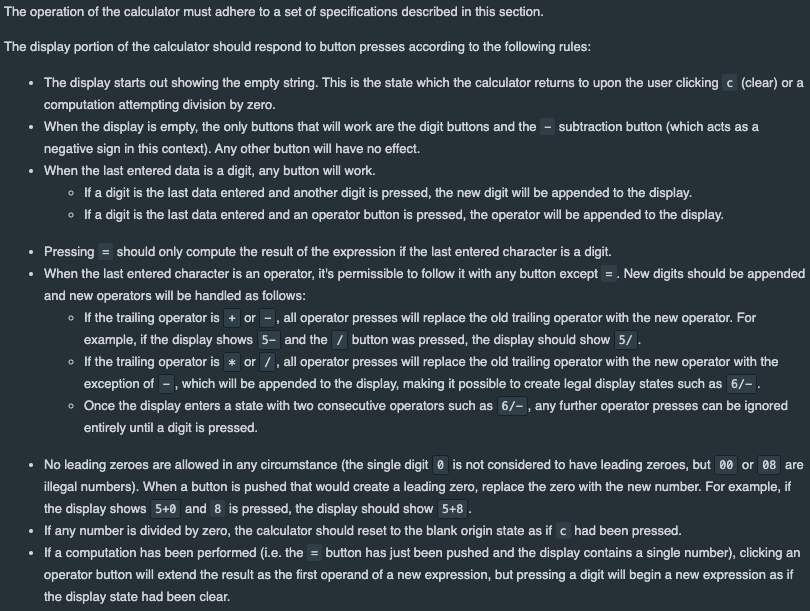
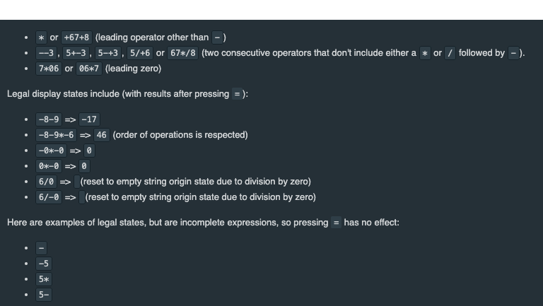

# React Challenge

## React: Calculator

Calculators are always handy to have in the browser! In this challenge, you'll make a calculator application with basic functionality. The capabilities will be limited in two important ways:

- All division operations will be floored, eliminating decimals and floats.
- The calculator will respond to button presses to constrain the input to remain valid, as described below.

### Buttons on the calculator

The calculator will feature a traditional, button-based interface and with no bells or whistles (no parenthesis, decimals, or special functions). There will be 16 buttons on the calculator:

- A set of numerical buttons permitting entry of digits 0-9.
- A set of four operation buttons corresponding to addition +, subtraction - , multiplication * and floor [integer division](http://mathworld.wolfram.com/IntegerDivision.html) /.
- An equals = button, which evaluates the expression shown on the display.
- A clear C  button, which resets the calculator to a blank state.

### Rendering your calculator

Layout, CSS and use of child components is up to you. The deliverables which the testing suite requires are specific classes which should be attached to buttons and the output element. Here is the comprehensive list of these elements and classes which the `Calculator` component must render for the testing suite to function:

- `
` contains a depiction of the current state of the calculator. It can only render characters corresponding those available on the below buttons.
- `<button class="digit-0">`, `<button class="digit-1">` ... `<button class="digit-9">` (one for each digit from 0-9) enable the user to enter numbers.
- `<button class="op-add">`, `<button class="op-sub">`, `<button class="op-mul">` and `<button class="op-div">` enable the user to enter a mathematical operator (addition, subtraction, multiplication and division, respectively).
- `<button class="eq">` enables the user to compute the result of an expression.
- `<button class="clear">` enables the user to reset the state of the calculator.

### Permitted operations

Illegal display states include:

### Additional notes

Since the calculator uses floor division for all operations (including intermediate operations), results will differ from division on a normal calculator or as produced by `eval`. You must implement your own miniature expression parser according to the specification for full credit in this challenge.

You may assume only small numbers are input; there's no need to worry about integer over- or under-flow in input, output or at any stage of the computation.

Comprehensive tests will be provided to you. Feel free to make changes to the test suite as you see fit--these changes will be ignored for the final submission.

CSS and UX are important, but secondary to logical functionality. Although there is no predetermined single solution or set of requirements for style, please take some time to present an interface that shows a fundamental grasp of the domain.

### Demo

This demo exercises the application requirements described above.

Remember, style is up to you--there's no need to copy the design shown here.

### Rubric

You'll be evaluated primarily on passing test cases and secondarily on code cleanliness and maintainability.

### Resources

Feel free to consult documentation as needed. Here are a few suggestions to start with:

- Wolfram is useful for determining how floor division should be evaluted. For example, one test case is `12/5=3` which you can try [here on Wolfram](https://www.wolframalpha.com/input/?i=floor%28-12%2F5%29).
- [React docs](https://reactjs.org/docs)
- [MDN](https://developer.mozilla.org/)